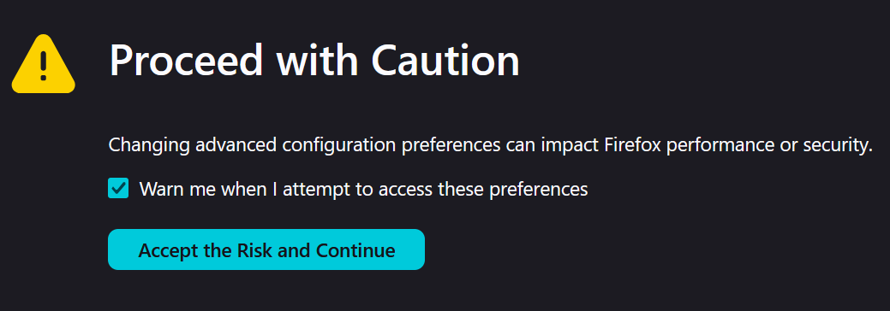

--- 
title: "Troubleshooting JSON viewing issues"
engine: knitr
execute:
  echo: false
format:
  html:
    toc: false
---


The first question to answer is how are you viewing the JSON file? If you don't have an [IDE^^]{.modal-ref data-bs-toggle="modal" data-bs-target="#IDE-details"} installed, then you will probably have two options; your operating system's (aka OS, likely one of Microsoft's Windows, Apple's MAC OS, or a [Linux distribution^^](https://www.linux.com/what-is-linux/)) default [text editor^^]{.modal-ref data-bs-toggle="modal" data-bs-target="#text-editor-details"}, or your web browser. **I recommend using your web browser to view JSON files while going through this tutorial**

## If you're seeing a wall of techno-gibberish when you open the file...

When viewing JSON in your web browser, the file will be opening in a new browser tab. If the thing you saw in a new browser tab looks like [this^^]{.modal-ref data-bs-toggle="modal" data-bs-target="#incorrect-JSON-format-view"}, then you need to enable JSON formatting in your browser. Here are some instructions for how you can do that ~~

#### Fixing formatting {#fixing_json_formatting}



By default, this JSON formatting should be enabled. If you're having issues, you can type [about:config]{.inline-code} in the address bar, press enter, and then you will be met with the following screen: 

{fig-alt="An image displaying the 'Accept Risk and Continue' screen displayed by Firefox when visiting the 'about:config' page"}

You should click "Accept the Risk and Continue", then in the search bar labelled "Search preference name" type in [devtools.jsonview.enabled]{.inline-code}. If the value that comes up says [false]{.inline-code}, you will will need to toggle it to [true]{.inline-code} with the button on the far right of the screen. 





As I understand it JSON formatting is not a default feature included. There are however a number of free JSON viewing/formatting extensions in the [chrome web store^^](https://chromewebstore.google.com/search/json%20viewer) which you can download for free to fix this issue for you.






As I understand it JSON formatting is not a default feature included. There are however a number of free JSON viewing/formatting extensions in the [App Store for Mac^^](https://apps.apple.com/us/app/json-peep-for-safari/id1458969831?mt=12) which you can download for free to fix this issue for you.





Microsoft edge does have a native formatting option, which you can enable by checking the "Pretty-print" checkbox at the top left of the screen when viewing an API response. There are also a number of [free extensions^^](https://microsoftedge.microsoft.com/addons/search/JSON%20viewer?filteredAddon=0&filterFeaturedAddons=false&filteredRating=0&sortBy=Relevance) on the Edge Add-on store



```{=html}
<!-- Modal -->
<div class="modal fade" id="text-editor-details" data-bs-keyboard="false" tabindex="-1"  aria-hidden="true">
  <div class="modal-dialog modal-dialog-scrollable">
    <div class="modal-content">
      <div class="modal-header">
        <h5 class="modal-title fs-5">Native OS Text Editors</h5>
        <button type="button" class="btn-close" data-bs-dismiss="modal" aria-label="Close"></button>
      </div>
      <div class="modal-body">
```
Text Editors are programs that allow you to view and edit text files. At the most simple, they allow you to open files with the [.txt]{.inline-code} file extension, but you can also open [.json]{.inline-code} files with them.

* Windows: Notepad

* Mac: TextEdit

* Linux: various different tools, nano/vim commonly default

I don't recommend using these, as JSON formatting features will not be integrated. Formatting is one of the features for developing code that makes "integrated development environments" like the open-source [VS Code^^](https://code.visualstudio.com/) useful. If you don't have VS Code installed already then just use an updated version of a modern web browser (Mozilla Firefox, Google Chrome, Apple's Safari, or Microsoft Edge)

 ```{=html}
      </div>
      <div class="modal-footer">
        <button type="button" class="btn btn-secondary" data-bs-dismiss="modal">Close</button>
      </div>
    </div>
  </div>
</div>
```


```{=html}
<!-- Modal -->
<div class="modal fade" id="IDE-details" data-bs-keyboard="false" tabindex="-1"  aria-hidden="true">
  <div class="modal-dialog modal-dialog-scrollable">
    <div class="modal-content">
      <div class="modal-header">
        <h5 class="modal-title fs-5">IDEs</h5>
        <button type="button" class="btn-close" data-bs-dismiss="modal" aria-label="Close"></button>
      </div>
      <div class="modal-body">
```

A good simple definiton of an IDE (from [Amazon Web Services^^](https://aws.amazon.com/what-is/ide/))

>What is an IDE?
>
>An integrated development environment (IDE) is a software application that helps programmers develop software code efficiently. It increases developer productivity by combining capabilities such as software editing, building, testing, and packaging in an easy-to-use application. Just as writers use text editors and accountants use spreadsheets, software developers use IDEs to make their job easier.

Some IDE examples that might be familiar to academics and data scientists are: [RStudio^^](https://posit.co/download/rstudio-desktop/), [Spyder^^](https://www.spyder-ide.org/), [MATLAB^^](https://www.mathworks.com/products/matlab.html)

The IDE which I recommend is [VS Code^^](https://code.visualstudio.com/), as it is open-source, has a huge community building useful extensions, and plenty of resources online of how to configure it to meet virtually any need you may have. 

 ```{=html}
      </div>
      <div class="modal-footer">
        <button type="button" class="btn btn-secondary" data-bs-dismiss="modal">Close</button>
      </div>
    </div>
  </div>
</div>
```


```{=html}
<!-- Modal -->
<div class="modal fade" id="incorrect-JSON-format-view" data-bs-keyboard="false" tabindex="-1"  aria-hidden="true">
  <div class="modal-dialog modal-dialog-scrollable">
    <div class="modal-content">
      <div class="modal-header">
        <h5 class="modal-title fs-5" >Incorrect Formatting</h5>
        <button type="button" class="btn-close" data-bs-dismiss="modal" aria-label="Close"></button>
      </div>
      <div class="modal-body">
```

```{python, echo=FALSE, class.output="plaintext_json_block" }
import json

with open("../../data/lancet-metadata-record-example.json", "r") as file:
    raw_json_str_for_outputting = str(json.load(file))
print(raw_json_str_for_outputting)
```

```{=html}
    </div>
    <div class="modal-footer">
      <button type="button" class="btn btn-secondary" data-bs-dismiss="modal">Close</button>
    </div>
  </div>
</div>
</div>
```