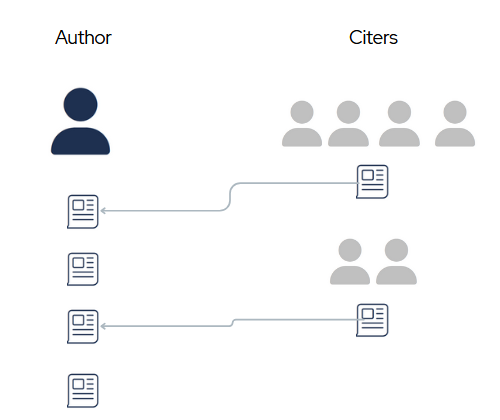
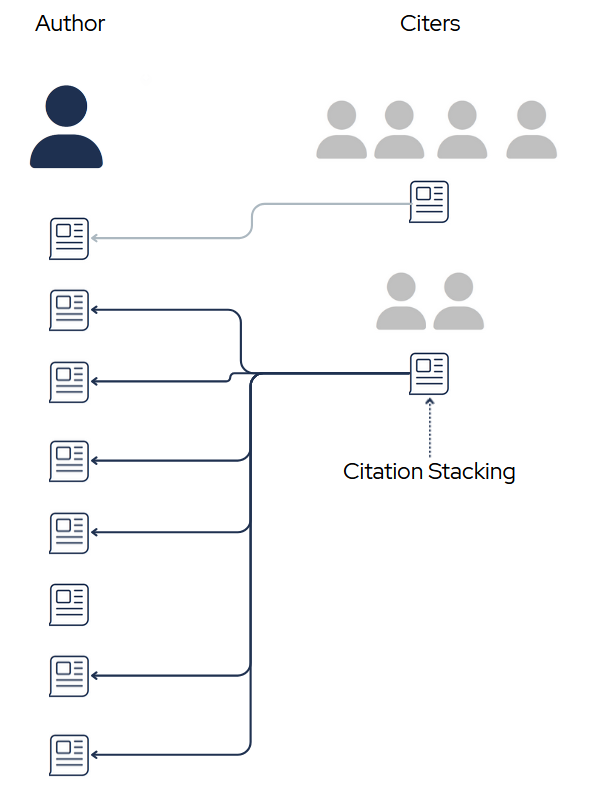
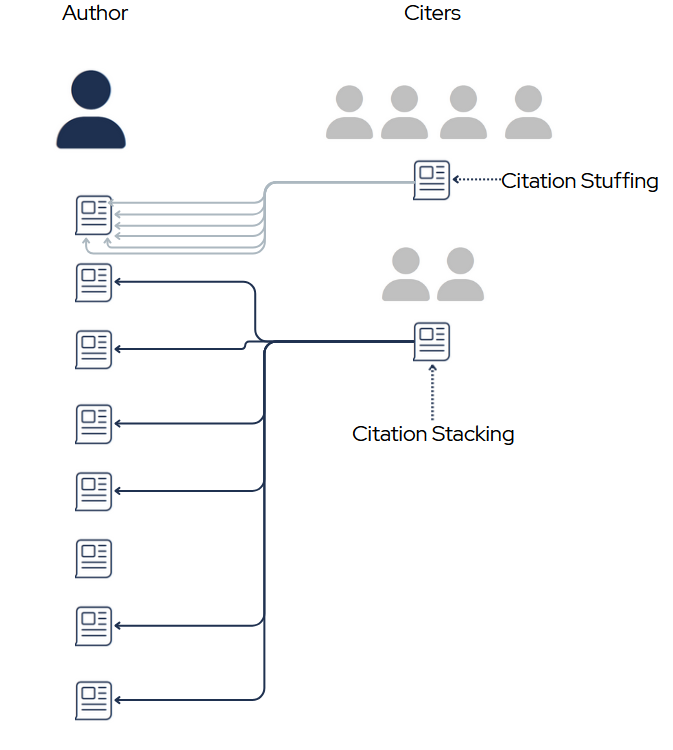
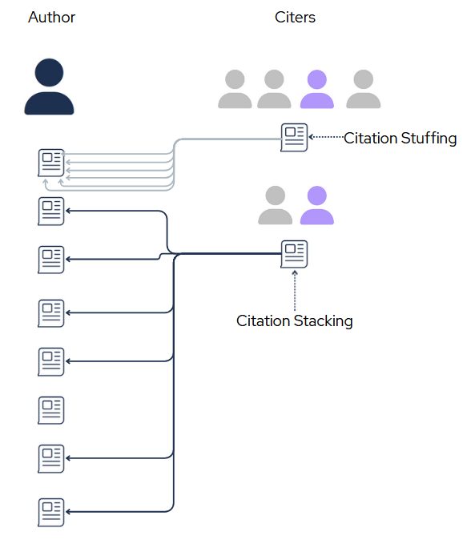

### Automating Reproducibility Checks for Journal Submissions

Inspired by conversations at the [IGDORE Reproducibilitea](https://onscienceandacademia.org/t/igdore-reproducibilitea-thread/2218) journal club, this project aims to automate the simpler aspects of the reproducibility check process for code submitted alongside a journal article. I developed a script that parses a codebase and notifies users of the following barriers to reproducibility:

* Files that are referenced in the code but are missing from the codebase
* Absolute paths to files that are machine-specific (e.g. ["C:/Users/Desktop/Data/data.csv"]{.inline-code})
    + Paths which are not resolvable (the locations don't exist in the database) are caught
    + Paths which are resolvable (the locations do exist) are replaced with relative paths (e.g. ["../Data/data.csv"]{.inline-code})
    
This project is still in early development. Try scanning a single file below (requires javascript to be enabled):

```{=html}
<br>
<input id="fileinput" class="btn" type="file">
```

### Detecting Post-Retraction Citation Awareness

This project used natural language processing of the fulltext of openly accessible research works to discern whether an article that cites a retracted article did so knowingly (acknowledging the retraction) or not. I began the project with the intention of providing data to inform the discussion in metascience about whether and how damaging post-retraction citations really are.

[Prior attempts](https://doi.org/10.1162/qss_a_00155) at classifying post-retraction intent used rule-based heuristics (e.g. "Does the citing sentence include the word retracted in it? Does the paper also cite a retraction notice?"). The semi-manually annotated datasets that came from this prior work allowed me to instead take a machine learning approach that made no prior assumptions of which textual or metadata features would be meaningful.

::: {.callout-note collapse="true" appearance="minimal"}
## Main Results
* After data preprocessing and hyperparameter optimization, the best performing model achieved an F1 score of ~0.91^[A previous version of this site reported higher model performance; while revisting the code in preparation for presenting at Metascience 2025, I noticed some rows in the annotated dataset I used for training were duplicated, and the resulting performance post-cleaning is reflected here now.] (accuracy=~91%, recall=~0.87, precision=~0.95)^[Training was done in a potentially over-conservative method: 70/30 train test split with 10-fold CV on the train set, the best performing model during CV being applied to the test set. With such a small training set to begin with, this approach may have lead to underfitting despite using an approach well suited to small datasets (logistic regression). When revamping this project for publication I hope to do a targeted analysis of under/overfitting throughout training with a larger dataset.] The specifics of what the data and preprocessing pipeline looked like will be detailed in a future blog post comparing the performance of classical machine learning approaches to text classification to modern deep learning approaches
  + Because the model was trained on PubMed's open access corpus with a bias towards biomedical research, I tested another model with every field-specific research keyword removed from the feature set. Accuracy was similar (F1=0.92, accuracy=91%, recall=0.92, precision=0.92), suggesting this method may generalize beyond this corpus.
  + Generalizability is hard for classification models trained on small datasets (this dataset had around 1200 rows after cleaning), and I am hesitant to make any claims about generalizability before demonstrating that the training process is resistant to overfitting and that the performance replicates over new, untrained-on test sets. Generating human-annotated test sets for this task is not easy since it can be ambiguous what consititues "knowledge of the retracted status". Pairing this with the fact that a previously published 'gold-standard' human annotated dataset had numerous annotation errors, it's clear that comparing model performance on previously annotated data is interesting, but can't easily conclude much about automated approaches' performance beyond annotation error without manually reviewing every decision. I made a proposal for a transparent, bias-resistant method for a single-author to release annotations and allow crowd-sourced correction in my poster [here](https://nomadit.co.uk/conference/metascience2025/paper/91292)
* Papers that the model incorrectly detected as acknowledging the cited work's retracted status were often cases where the authors nonetheless had serious reservations about the cited work or were expressing contradictory evidence. This suggests textual analysis tools may be useful in quantifying or predicting scientific dispute or future retraction.
:::

::: {.callout-note collapse="true" appearance="minimal"}
## Highly Predictive Features

| **Text Feature**  | **Example** | **Source** |
|-|:----|-:|
| "earlier" | "We have **earlier** reported our results interpreted... but we [withdrew]{.light} this [report]{.light} as..." | [link](https://doi.org/10.3389/fimmu.2018.01623) |
| "origin*" | "...The publication provoked an academic debate, resulting in eighteen letters to the editor of the journal and the **original** article being [retracted]{.light}."  | [link](https://doi.org/10.1007/s11948-017-9916-0) |
| "withdr*" | "[Subsequent]{.light} work revealed that the proliferation data described in the initial report could not be replicated and the report was **withdrawn**"   | [link](https://arthritis-research.biomedcentral.com/articles/10.1186/ar2145) |


: Features highly predictive of knowingly citing the retracted work


| **Text Feature**  | **Example** | **Source** |
|-|:----|-:|
| ", suggest*" | ""[Increased]{.light} intracellular Pb has been linked to an [increase]{.light} in secreted levels of the AD-causing Aβ…Furthermore, [increased]{.light} levels of Aβ…may be associated with poor learning and memory performance as observed**, suggesting** a causative relation between…Some studies pointed out that SIRT1 may influence both Aβ and neurofibrillary tau pathology in the transgenic mouse models of AD (Herskovits and Guarente, 2014)." | [link](https://doi.org/10.3389/fphys.2017.00446) |
| "decrease"[^1] | ""For assessment of the systolic function of the heart, fractional shortening and ejection fraction (EF) were used…This is in line with that found in a study by Laaban et al. [41] who described **decreased** eject fraction…Ejection fraction and fractional shortening correlated with age has already been described previously [43]."| [link](https://doi.org/10.1007/s00408-013-9471-7) |

: Features highly predictive of unknowingly citing the retracted work

[^1]: Here the retracted citation is [43], and the word "decreased" is not being used in reference to the citation, but its presence indicates a routine description of scientific findings, the kind of routine description where retracted works often were unacknowledged.
:::

### Hijacked Journal Detection Toolbox

Inspired by Anna Abalkina's [reporting](https://retractionwatch.com/2023/05/26/three-journals-web-domains-expired-then-major-indexes-pointed-to-hijacked-versions/) on the hijacking of the Russian Law Journal, I used Crossref's API to investigate how these paper mill articles were able to receive valid DOIs, and discovered a new method fraudsters are using to spoof the identity of journals they are hijacking. Rather than just buying the web-domain or typosquatting a similar web domain, they are able to register DOIs under the same journal title in 3rd party DOI provider databases like Crossref. 

```{=html}
<form>
    <label for="getRLJInput">Click here to see a publicly available record of a publisher spoofing the identity of a journal it
      hijacked (using Crossref metadata):
    </label>
    <noscript>
      <div class="alert alert-danger" role="alert">
        It seems like javascript is disabled in your browser.
        Here are the <a href="https://www.enable-javascript.com/">
          instructions how to enable JavaScript in your web browser, which will allow you to use the interactive tools below</a>.
      </div>
    </noscript>

  <button class="btn btn-light" type="button" id="getRLJ" data-bs-toggle="collapse" data-bs-target="#collapseExampleRLJ"
    aria-expanded="" aria-controls="collapseExampleRLJ">
    Show Crossref metadata for known-hijacked "Russian Law Journal
  </button>
  </form>

  <div class="collapse" id="collapseExampleRLJ">
    <div class="card card-body">
      <div class="TablegetRLJ">
        <p class='loadingsign'>Loading...</p>
        <table>
        </table>
      </div>
    </div>
  </div>
  <p></p>
  <p id="PgetRLJ"></p>
```
In the process of investigating these hijackings, I found myself using a set of API calls and scripts often, and I am developing them into a browser extension to help other sleuths quickly check for signs of a journal hijacking. Here are some common API calls:


Type a journal title search query to search for **duplicate journal titles** (can be a sign of a hijacking) registered in Crossref's database. The tool will show only up to the first 30 duplicate listings (double click submit to try a different query. May take a while to load). If your query is overly broad ("Science", e.g.) it's possible it will fail to detect due to [technical reasons]{.inline-code}^[Currently I am not using cursors as I expected users to have a particular journal in mind. If none of the first 30 results for the query match exactly, it will not (as of 4/8/25) search the next page of results. This can be easily fixed when I get around to it.]

```{=html}
<form id="queryFormid">
              <input style="width:40vw;" type="text" id="queryInput" placeholder="American Journal of Public Health" value="American Journal of Public Health">
              <button class="btn btn-light" type="button" id="queryInputSubmit" data-bs-toggle="collapse"
                data-bs-target="#collapseExampleGenericJournal" aria-expanded="false" aria-controls="collapseExampleGenericJournal">
                Submit
              </button>
            </form>
            <div class="collapse" id="collapseExampleGenericJournal">
              <div class="card card-body">
                <div class="TablegetJournalGeneric">
                  <p class='loadingsign'>Loading...</p>
                  <table>
                  </table>
                </div>
              </div>
            </div>
            <br>
            <form id="CRdoiForm">
              <div id="DOIinputDiv">
              <label>Input a DOI to find the Crossref Member that Submitted it:</label><br>
              <input type="text"  id="doiinput", placeholder="https://doi.org/10.52783/rlj.v11i5.2651" value ="https://doi.org/10.52783/rlj.v11i5.2651">
              <input id="CRdoiSubmit" class="btn btn-light" type="submit">
            <br>
            <p id="failMemberFind">Failed to find member, either because the query you submitted was not a DOI or had an invalid prefix. To check if the DOI is registered through crossref, try: <span class="inline-code">https://api.crossref.org/works/{doi}/agency</span></p>
            <div style="padding-left:5%">
            <p id="PmemberName">
            </p>  
            <p id="PmemberID"> 
            </p>
            </div>
            </div>

            </form>
            <br>
            <p id="memberIDErrorMsg">
              <label>Input a valid Crossref Member ID to find all the journals it publishes. A maximum of 100 journals will be
                displayed. (may take a few
                seconds to load for high-volume publishers):</label>
              <br>
            
            <form id="CRapiForm">

              <div class="form-check">
                <input class="form-check-input" type="checkbox" value="" id="limitNumReturnedJournalsCheckbox">
                <label class="form-check-label" style="margin-left:5%" for="limitNumReturnedJournalsCheckbox">
                  Limit number of results for better performance?
                </label>
                
              </div>
              
              
              <input type="text" id="numJournalToLimitToInput" placeholder="10" value="10" style="display:none;">
              <input type="text" id="memberIDinput" placeholder="30593" value="30593" list="memberIDlist">
              <datalist id="memberIDlist">
                <option value="30593"></option>
                <option value="31492"></option>
                <option value="51526"></option>
              </datalist>
            
              <input type="submit" class="btn btn-light" id="memberIDforJournalsGetSubmit" data-bs-toggle="collapse"
                data-bs-target="#collapsememberIDforJournalsGetSubmit" aria-expanded="false"
                aria-controls="collapsememberIDforJournalsGetSubmit">
            </form>
            <div class="collapse" id="collapsememberIDforJournalsGetSubmit">
              <div class="card card-body">
                <div class="TablememberIDforJournalsGetSubmit">
                  <p id="memberIDErrorMsg2" style="display:none;"></p>
                  <p class='loadingsign' id="">Loading...this can sometimes take up to 10 seconds or more</p>
                  <!-- _todo deal with loading sign on error _later -->
                  <table>
                  </table>
                </div>
              </div>
            </div>
            </p>
            <label>Input a publisher ID and find all of its registered journals that have already been registered (possible hijacked
              journals):</label>
            <form id="findAllHijackedJournals">
              <input type="text" id="findAllHijackedJournalsInput" placeholder="30593" value="">
              <button id="findAllHijackedJournalsSubmit" class="btn btn-light">Submit</button>
            </form>
```

::: {.callout-note appearance="minimal"}
If you are a Research Integrity Specialist and would like to use these tools in your workflow, you can bookmark [this page](../toolbox/index.qmd) where I will be keeping the tools most up-to-date
:::

### Discovering Unreasonable Citation Stacking

I'm developing an algorithm to scan the scientific literature and identify authors that have an unusually high number of papers with signs of citation stacking (the presence of many citations to a single author (or group of authors) that are not the result of honest scientific work but rather the result of gaming citation metrics). I'm planning to turn this into a package that is inter-operable with many types of data sources (Scopus, Crossref, OpenAlex) for others to use. Inspired by El País's [reporting](https://english.elpais.com/science-tech/2024-03-20/the-aspiring-university-rector-who-wrote-a-four-paragraph-paper-and-cited-himself-100-times.html) on a case of extreme self-citation stacking among an esteemed computer scientist. 

Here are a few easily detectable ways in which the standard citing pattern can be manipulated:

:::{.callout-note collapse="true" appearance="minimal"}
## Standard Citing Pattern

{fig-alt="_todo"}
:::

:::{.callout-note collapse="true" appearance="minimal"}
## Citation Stacking Pattern

{fig-alt="_todo"}
:::

:::{.callout-note collapse="true" appearance="minimal"}
## Citation Stuffing Pattern

{fig-alt="_todo"}
:::

:::{.callout-note collapse="true" appearance="minimal"}
## Highly (or unduly) Influenced Individuals Pattern

{fig-alt="_todo"}

Here one individual (purple) seems to be highly influenced by the author's work. Signs of this pattern are 1) citing many different works of the author in their own papers (potential stacking) and 2) citing a single work of the author many times in their papers (potential stuffing). These for any given author, these individuals can be detected merely by using metadata provider APIs (e.g. Crossref, Scopus, OpenAlex). Further inspection can determine if the influence is undue (evidence of citation orchestration) or the result of legitimate academic dialogue. One example of such dialogue is that scholarly books on the history of Albert Einstein's theory of relativity would not only cite many of Einstein's papers, but also may cite individual papers many times. I am exploring ways to normalize repeat citations by the length of the citing scholarly work.
:::

### Predicting Paper Acceptance Status from Peer Reviews

I used Computer Science conference paper [peer reviews](https://github.com/allenai/PeerRead) to train a ML model to predict whether the paper was accepted or rejected. If done well, algorithms like these can lighten the load of editors' jobs by helping them synthesize or make decisions on acceptance/rejection altogether (though much improvement must be made before that responsibility can be safely passed). First attempts had poorer performance than I had hoped for, so I am currently revamping with a more sophisticated feature representation that will hopefully capture more nuance.  

---

# Older Projects

### Detecting and Denoising EEG Artifacts

Replicating the results of [Li et al. 2023](https://ieeexplore.ieee.org/document/10130669). Created semi-simulated noisy EEG data using an open dataset of common EEG artifacts to train a segmentation neural network to detect where artifacts occur. Although an adjustment needed to be made to match the codebase with the presented methods in the paper, the accuracy of the artifact detection network largely replicated. Approaches like these are promising, as artifact removal is both a highly time-consuming and bias-injecting step in the standard preprocessing pipeline of EEG experiments, however I seriously question the generalizability of this group's model due to major flaws in the assumptions behind the 'clean' EEG dataset used in training. 


### Automatically Detecting Sleep Spindles on EEG

Replicating the best performing algorithm from [Lacourse et al. 2018](https://doi.org/10.1016/j.jneumeth.2018.08.014) and comparing to a replicated version of [Lustenberger et al. 2016](https://doi.org/10.1016/j.cub.2016.06.044). Adding fuzzy logic to the sliding window reduce false negatives on by-event analysis due to singular sample outliers. 

### Cognitive Task Anti-Cheating 

Spinoff analysis that came from working on a working memory cognitive task experiment where participants were instructed to attend to the center of their visual field and were prompted to recall stimuli according to, among other things, which visual hemifield the stimuli were presented in. Explored the feasibility of detecting a bias in performance on one side that would suggest participants are not attending to the center of their visual field, but rather 'cheating' to one side to improve their odds by minimizing the amount of information they must hold in their working memory.

